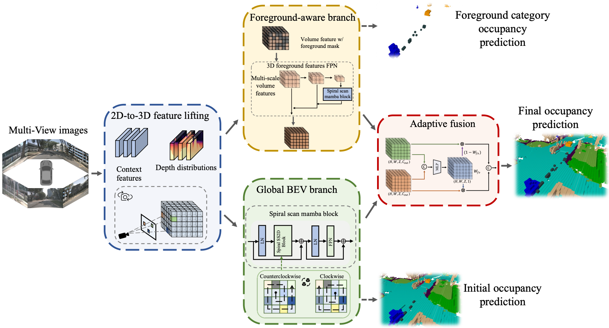
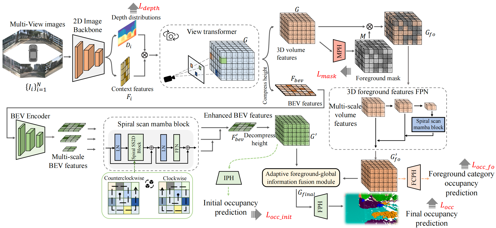
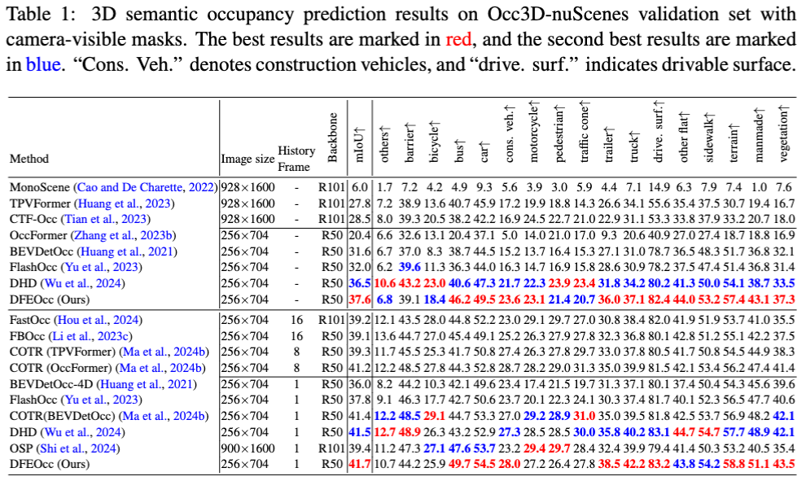
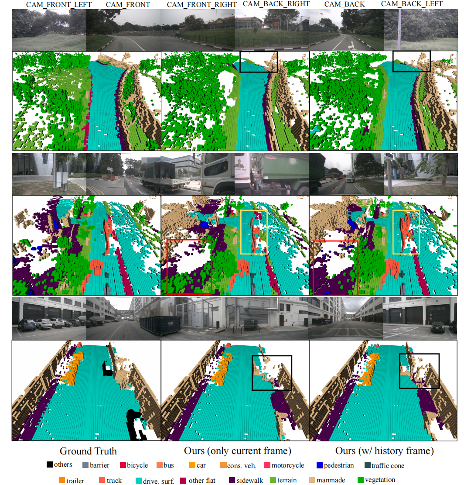

# DFEOcc: A Dual-Stream Foreground-Aware Enhancement Network with SpiralScan-Mamba for Vision-Based Occupancy Prediction in Autonomous Driving

<div align="center">
  <a href="https://www.sciencedirect.com/science/article/pii/S0952197626007293">Our Paper (EAAI)</a>
</div>

## Abstract
In autonomous driving perception, conventional 3D object detection uses a closed set of categories and consequently fails to respond to previously unseen objects. By contrast, occupancy prediction estimates per-voxel occupancy and semantics, delivering finer geometric detail and approximate distance while generalizing beyond known classes to support downstream planning. Despite these advantages, prevailing occupancy architectures suffer from foreground-background imbalance and peripheral feature sparsity, which hinder accurate reasoning about the more critical foreground categories for autonomous driving and distant objects. To address these limitations, we propose a dual-stream framework that combines voxel-based modeling to strengthen foreground representation with a bird's-eye-view stream for efficient global feature extraction, employs an adaptive foreground-global information fusion module to flexibly integrate complementary information across the two streams. Additionally, we introduce a Mamba-based spiral scanning mechanism that propagates structural priors from dense central areas to peripheral regions, effectively enriching boundary features. Experimental results demonstrate that our method achieves competitive state-of-the-art performance, with notably stronger foreground-category prediction and performance robust to low-resolution inputs.

## Overview

### Graphical Abstract


### Overview of our Pipeline



## Get Started
### 1. [Environment Setup](doc/install.md)

### 2. Data Preparation

step 1. Prepare nuScenes dataset. Download [nuScene dataset](https://www.nuscenes.org/).
```shell script
└── Path_to_DFEOcc/
    └── data	
        └── nuscenes
            ├── v1.0-trainval 
            ├── sweeps  
            └── samples
```

step 2. create the pkl for DFEOcc by running:
```shell
python tools/create_data_bevdet.py
```
thus, the folder will be ranged as following:
```shell script
└── Path_to_DFEOcc/
    └── data
        └── nuscenes
            ├── v1.0-trainval (existing)
            ├── sweeps  (existing)
            ├── samples (existing)
            ├── bevdetv2-nuscenes_infos_train.pkl (new)
            └── bevdetv2-nuscenes_infos_val.pkl (new)
```

step 3. For Occupancy Prediction task, download (only) the 'gts' from [CVPR2023-3D-Occupancy-Prediction](https://github.com/Tsinghua-MARS-Lab/Occ3D?tab=readme-ov-file#occ3d-nuScenes) and arrange the folder as:
```shell script
└── Path_to_DFEOcc/
    └── data
        └── nuscenes
            ├── v1.0-trainval (existing)
            ├── sweeps  (existing)
            ├── samples (existing)
            ├── gts (new)
            ├── bevdetv2-nuscenes_infos_train.pkl (new)
            └── bevdetv2-nuscenes_infos_val.pkl (new)
```
### 3. Model Training and Testing

#### Download model weights
[DFEOcc weights (single frame), DFEOcc weights (w/ historical frame)](https://drive.google.com/drive/folders/16OH_27KwrFEdC_8XIOuGgVa3wbsOpRn4?usp=sharing). And arrange the folder as:

```shell script
└── Path_to_DFEOcc/
    ├── data
    ├── projects
    ├── tools
    ......
    └── ckpts (new)
        ├── occ_mamba_fo_r50 (new)
            └── best_376.pth (new)
        └── occ_mamba_fo_4d_stereo_r50 (new)
            └── best_4173.pth (new)
```
    
#### Test model

```shell
# single gpu
python tools/test.py $config $checkpoint --eval mAP
# multiple gpu
./tools/dist_test.sh $config $checkpoint num_gpu --eval mAP
# for example (w/o historical frame)
./tools/dist_test.sh projects/configs/occ_mamba_fo/occ_mamba_fo_r50.py ckpts/occ_mamba_fo_r50/best_376.pth 4 --eval mAP
# for example (w/ historical frame)
./tools/dist_test.sh projects/configs/occ_mamba_fo/occ_mamba_fo_4d_stereo_r50.py ckpts/occ_mamba_fo_4d_stereo_r50/best_4173.pth 4 --eval mAP
```

#### Train model
```shell
# single gpu
python tools/train.py $config
# multiple gpu
./tools/dist_train.sh $config num_gpu
# for example
./tools/dist_train.sh projects/configs/occ_mamba_fo/occ_mamba_fo_r50.py 4
```

## Experiment

### Quantitative comparison


### Visual Comparison


## Acknowledgements
We thank [BEVDet](https://github.com/HuangJunJie2017/BEVDet), [FlashOcc](https://github.com/Yzichen/FlashOCC), [DHD](https://github.com/yanzq95/DHD?tab=readme-ov-file#quantitative-comparison) and [VMamba](https://github.com/MzeroMiko/VMamba?tab=readme-ov-file) for their foundational contributions. Their pioneering work inspired and guided this research.

## Citations